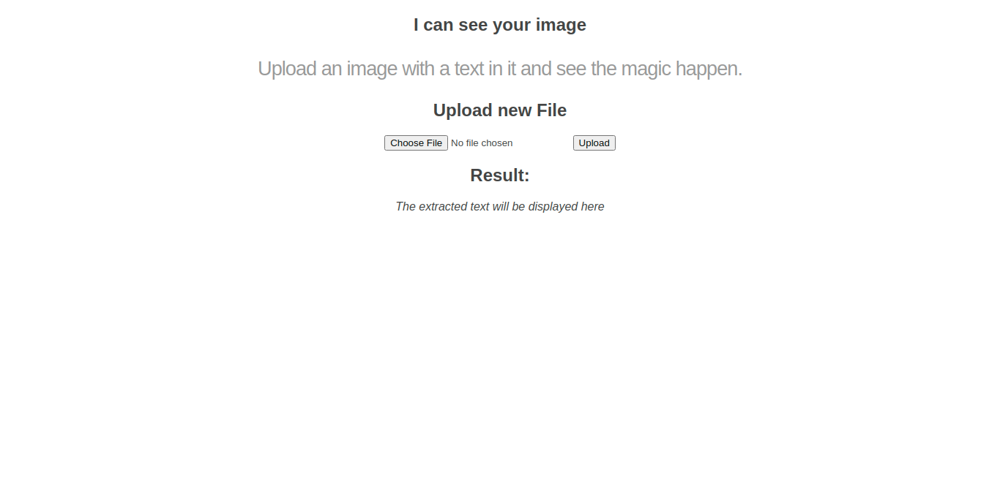

# py_ocr_flask_app
App for magically read text encoded in your images. Just upload one and see the magic happen.

## UI Demo

## Stack
- Backend: Python + Flask
- Services: Tesseract (via PyTesseract)
- FrontEnd: Jinja (Flask)

## How to install
In your terminal, use: 

`git clone https://github.com/laionazeredo/py_ocr_flask_app.git`

After cloning, go to:

`cd py_ocr_flask_app`

and, once inside the root directory:

`pip install -r requirements.txt`

This will install all the dependencies you need to start the app.

## How to initiate

Open you terminal and do in your terminal in the root directory:

`python app.py`

This will start your app at the localhost listening at port 5000.

## How to test
To run all test cases at once, do in your terminal in the root directory:
`python -m unittest --verbose`

## Future issues
- Better UI